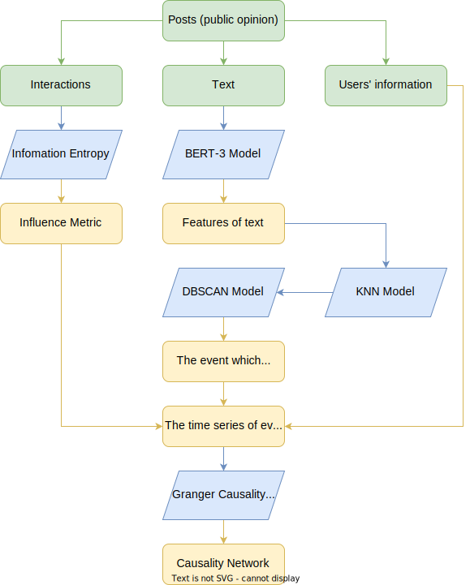
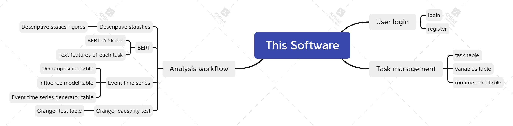
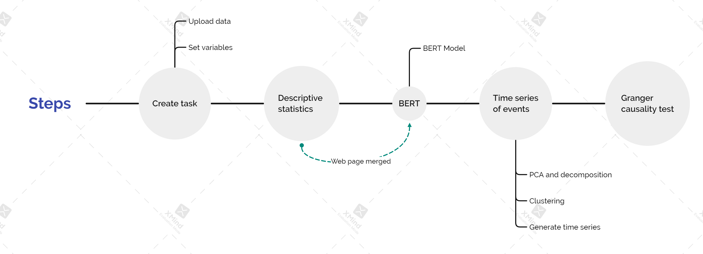

# "weibo.com" Granger causality

Granger causality test for the posts in social networks 


 **This documentation is contains math formulas in Latex format. Please browser it in contemporary markdown software.**

 **Machine translation from Chinese to English by translate.google.com**
 
## Introduction

A discussion will be raised when an enterprise, organization of famous
individual announces an activity. However, their competitors (especially
bad ones) will hire a lot of robots and zombie accounts to publish
negative opinions in social networks. This phenomenon will drive normal
individuals away from the truth.

This software can:

1. Find obvious events against the noisy and unordered opinions.
2. Test the causality between highly active accounts, to figure out how one is affected by other's opinions or affects others.

The software use BERT-3 model to extract features from text, and use DBSCAN
algorithm to cluster posts into several events. Finally, it uses Granger
causality test to figure out the causality between different accounts.

As a conclusion, this technology is designed to help distinguish real public 
opinion from intended intensive promotion.

## Functions

The analysis flow of the software is shown in Figure 1. The green part represents the original data entered by the user, the blue part (parallelogram) represents the calculation process, and the yellow part (rectangle) represents the data of the intermediate process.


Figure 1.

Posts can be exported through tools provided by public opinion forums, obtained through web crawlers, or collected manually. Specifically, Sina Weibo posts are recommended to be collected using [this tool](https://github.com/cloudy-sfu/Web-Crawler-for--sina-weibo-), but it is not required. The structure of the post is a two-dimensional table in Microsoft Excel format, which must contain 1 field representing the user's identity (unique serial number), 1 field representing the body of the post, and a variable number representing interaction counts (reposts, likes, comments, etc. ) field.

After the user marks these fields through the form, the software is divided into two main lines, which are processed and synthesized respectively to synthesize the "time series of events" data.

### 1. Analyzing interactions

The engagement metrics for all posts is a $(N×n_f)$ matrix, where $N$ is the number of posts and n_f is the number of engagement metrics. Each column of the matrix represents a single interaction metric. The software first performs logarithmic transformation $x \to \ln⁡(x+1)$ on the matrix, and then performs normalization transformation $x \to \frac{x-\min ⁡x}{\max ⁡x - \min ⁡x}$ by column, and then converts the matrix **by row**. Weighted by information entropy. The information entropy of each indicator is shown in Equation 1.

$$
p(x) = - \sum p(x_i) \ln p(x_i)
$$
Equation 1.

The influence metric of a post is a $(N×1)$ vector representing the ability of the post to elicit engagement from other users.

### 2. Analyzing text

The text of all posts is a list of strings of length $N$. The BERT-3 model is a trained neural network model (pooled mode) that accepts a list of strings as input and outputs a $(N×768)$ matrix representing text features. With the BERT-3 model, the list of strings is transformed into a matrix, where each row represents the features of a string.

The software needs to cluster public opinion texts into events, so dimensionality reduction is required. After the transformation of the principal component analysis, each dimension of the feature vector is independent of each other, and is arranged in descending order according to the variance explaining the original data. The software uses principal component analysis (PCA model) to project the eigenvectors into the orthogonal space, and draws a "line chart of the proportion of explained variance". The variance of , the proportion of variance explained by all dimensions in the original data. By observing the "Explained Variance Proportion Line Chart", the user makes a trade-off between the number of retained dimensions and the ratio of retained information, and fills in the number of retained dimensions.

The software reduces the dimension according to the filled quantity, and then makes a normalized transformation $x \to \frac{x -\bar{x}}{\textrm{std}\ x}$ by column as the sample space for clustering. The software uses the DBSCAN algorithm for clustering; the algorithm needs to determine the values of minPts and Eps parameters, the detailed meanings are as follows:

(1) The algorithm randomly selects a sample point to start. If there are no less than minPts points in its neighborhood with a radius of Eps, mark it and the points in its neighborhood radius as a class, otherwise it becomes an isolated point.

(2) If the point is not an isolated point, the algorithm traverses the points in its neighborhood and repeats step (1) until starting from this point, all points that can be bridged by the neighborhood radius are marked as a class.

(3) The algorithm randomly selects one of the unlabeled sample points to start, repeats steps (1, 2), and at this time marks the sample point as another class. Until all the sample points are marked as a certain class or outlier, the clustering ends.

Since users without a data science background cannot properly set minPts and Eps, the software automatically sets the parameters through some rules of thumb. minPts is set to be 2 times the sample dimension [1]. The software calculates the Chebyshev distance from each point to other sample points, arranges them from small to large, and takes the minPts-th distance as the K-nearest neighbor distance of this point (K=minPts). Then, the software arranges each point according to the K-nearest neighbor distance from small to large, and draws a "K-nearest neighbor distance line graph". The user observes the image, selects the inflection point of the downward convex function of the curve, and the corresponding ordinate is the value of the Eps parameter.

> [1] Sander, Jörg, et al. "Density-based clustering in spatial databases: The algorithm gdbscan and its applications." _Data mining and knowledge discovery_ 2.2 (1998): 169-194.

When clustering in low-dimensional space, the curve is almost always downwardly convex, so usually the inflection point of the downwardly convex function should be selected, which is the most suitable clustering method; in high-dimensional space, the curve contains multiple downwardly convex functions, Each inflection point has a different meaning, so you can choose any inflection point, or any point between inflection points. In text feature clustering, each inflection point represents similarity at different levels. Generally, the distances from small to large are language-level similarity, semantic-level similarity, topic-level similarity, and semantic style similarity. Users can choose according to their analysis preferences. . If you want to analyze public opinion events, you can choose the similarity at the topic and semantic style level.

After the user sets the Eps parameter, the software executes the DBSCAN algorithm and outputs the category number of each post, representing the public opinion event to which the post belongs. All isolated points are regarded as public opinion events numbered -1, which means that the content of the post does not belong to any event.

### 3. Granger causality test

Set the sampling times of the time series $n_t-1$, the software divides the time period between the earliest and latest posting times into n_t intervals equidistantly (the first interval means not within the time period, and is reserved for time errors , usually empty). The software generates an all-zero tensor of $(n_u \times n_t \times n_e)$, where $n_u$ is the number of posters (users of the public opinion community), and $n_e$ is the number of public opinion events (including event-1) obtained by clustering.

For each post, find the serial number, time interval, and topic of the poster, add the influence index $I$ to the corresponding position of the tensor, and add $Ie^(- rΔt)$, where $e$ is the base of the natural logarithm, $r$ is the influence attenuation multiplier (set by the user), and the time interval is $Δt$ time interval from the time interval of posting. Thus, the software obtains a time series of the influence of each poster on each event, referred to as the time series of events for short.

The software compares the time series of the specified events between the two users, and for the given "maximum lag" parameter, calculates the Granger causality test statistic $F$ and the significance level $p$. In general, if at the $L$-th lag $p< 0.05$, it means that one user has an influence on another (causal relationship is directional), and the influence propagation takes $L$ time intervals. The Granger causality test uses the linear pairwise causality criterion \[2\] \[3\], with two basic assumptions:

> [2] Eichler, Michael (2012). "Causal Inference in Time Series Analysis" (PDF). In Berzuini, Carlo (ed.). Causality : statistical perspectives and applications (3rd ed.). Hoboken, N.J.: Wiley. pp. 327–352. ISBN 978-0470665565.
> [3] Granger, C.W.J. (1980). "Testing for causality: A personal viewpoint". Journal of Economic Dynamics and Control. 2: 329–352. doi:10.1016/0165-1889(80)90069-X.

1. Cause precedes effect;
2. The future value of the result sequence, with specific information depending on the cause sequence.

According to the above basic assumptions, the conditions for estimating that X has an influence on Y are shown in Equation 2. Among them, $L_{X,Y}(t)$ represents all the information of X and Y before time t; $L_Y(t)$ represents only the information of Y before time t.

$$
\mathbb{P}[Y(t+1)|L_{X,Y}(t)] \neq \mathbb{P}[Y(t+1) | L_Y(t)]
$$
Equation 2.

Strictly speaking, Granger causality requires differencing to make the time series stationary. Considering the practical significance of public opinion dissemination, the time series represents the change of the influence of public opinion, so the software does not test the stationarity and difference of the time series.

The software outputs the statistics F and p to the user.

## Acknowledgement

[BERT-3 Preprocessing (Chinese Language)](https://tfhub.dev/tensorflow/bert_zh_preprocess/3)

[BERT-3 Model (Chinese Language)](https://tfhub.dev/tensorflow/bert_zh_L-12_H-768_A-12/3)

[Data collection tool](https://github.com/dataabc/weibo-search)

## Structure

The structure of this software is shown in Fugre 2, while the analyzing process is shown in FIgure 3.


Figure 2.


Figure 3.

All analysis process modules have dependencies on task management modules, and each analysis module has dependencies on modules located in front of the calculation steps.
User login: This module is responsible for the user's login and registration functions. It inherits from the Authorize module of the Django function library and has the function of sending a registration confirmation email to the user.

Task management: This module is responsible for managing all analysis tasks, each task has independent data, models, and results; this module manages the busy state of each analysis task, collects error prompts, and maintains data sets and related information. In the analysis process, this module has the functions of creating tasks, receiving data sets, and analyzing variables.

Descriptive Statistics: This module is responsible for drawing descriptive statistical graphs, including a segmented line graph of the number of user posts - the number of users, and a histogram of the number of daily posts. The BERT-3 model has no interaction and uses 1 page in combination with the descriptive statistics module. This module has a "Descriptive Statistics Chart" database table.

BERT: This module is responsible for calling the BERT-3 model and saving the operation results. The text features extracted by each task correspond to a record in the database table managed by this module. The start button of this module is on the page shared with the "Descriptive Statistics" module. After the analysis is completed, it directly jumps to the "Time Series of Events" module.

Time series of events: This module is responsible for analyzing the influence of posts and the public opinion events to which they belong. It contains 3 database tables: dimensionality reduction model, influence model, and time series of events. The corresponding multiple analysis steps are shown in Figure 3. All intermediate variables, models, and parameters in the process are stored in three database tables.

Granger causality test: input the time series of events, this module is responsible for calculating the Granger causality, and storing the fixed parameters of the last analysis, including a data table.

## Installation

The current folder of command line is the software's project root.

### 1. Token

Create a `token/` in project root, and include the following files in it.

(1) `django_secret_key`: There should be a string about 52 characters, being a secret key for 
communication between client and web server. The string can be generated in [Djecrety](https://djecrety.ir/) website.

(2) `smtp.json`: If you don't use a registration confirming service by email, `smtp.json` is 
not necessary. At the same time, you should disable registry related links in `sina_event_chain_django_cn/urls.py`.

There should be the config of web maintainer's email sender in this file. The format is:

```json
{
  "host": "example.com",
  "port": 465,
  "username": "registration@example.com",
  "password": "anypassword"
}
```

### 2. Python environment

Install required Python packages:

```
pip install -r requirements.txt
```

It is a maximum required package. With the environment, all functions can be used, but not all functions are necessary.

Navigate to the project folder, and create the database and superuser:

```
python manage.py migrate
python manage.py createsuperuser
```

Follow the instructions in the command line. This user has the highest permission in this software.

### 3. Administrator's settings

Run the command: 

```
python manage.py 0.0.0.0:$port --insecure
```

The IP address can only be 127.0.0.1 (for local use only) or 0.0.0.0 (for web server), and `port` can be customized. After that, the website will be running at `https://example.com:$port/main`.

(1) Registry permission

1. Visit `https://example.com:$port/admin`. 
2. Create at least one group instance, for example, named "Free plan" and users can freely register into.
3. Create a register group instance, and link to "Free plan".
4. Add proper permissions to "Free plan", at least including: "add, change, view Register", "add, delete, change, view Task", "add, delete, change, view AsyncErrorMessage", and   "add, delete, change, view Column".
